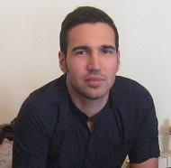

## Aryan Safari 

### Contact Info: [Linkdin](https://www.linkedin.com/in/aryan-safari-b014b985/)  

### Skill

C programing, Java, AutoCAD, GIS, Excell

## Language
Farsi, English

## Education

Bachelor degree in Urban Engineering.

Current Computer Science(College).

## Education Experience

Thesis Urban Engineering: (City Night Life)

Currently working in bachelor in CS and attending in Palomar and MiraCosta College.

### Work Experience: 

Research in Urban engineering field: Subject, how to grow a specific zone, and how to enhance the performance of organic regions. (University of Tehran-Iran 2012-2013) 

Associate, JC-Penney (Escondido, CA 2014-2016)

Shoes Leader, JC-Penney (Escondido, CA 2014-2016)

Cap2 Associate, Wal-Mart (Poway, CA, 2017-07/14/2018)

Support manager, Wal-Mart (Poway, CA, 07/15/2018- now)

### Summary Statement:

As a fast learner and a hard worker, I'm ready to take up any challenge, striving to quickly become an excellent member of your team and will apply my skill set where it's possible to improve the process. 
I'm looking for an opportunity to work in (the shift that you available) to be able to support myself and continue my education.

### Goal

Finish My Bachelor Degree and Start My Master Degree in Computer Science

### My Email: Arrarose@gmail.com
### phone: (858)208-6286
